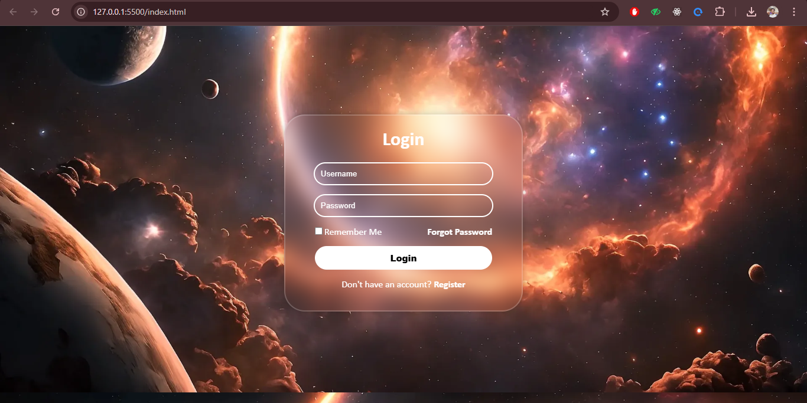

# Login Page Using CSS

I have create beautiful login page using HTML + CSS.

## Technologies Used

- **HTML**
- **CSS**

## How to Run the Project

1. Clone the repository:

   ```bash
   git clone <repository-url>
   ```

2. Navigate to the project directory:

   ```bash
   cd Login-Page
   ```
5. Open your browser and go to:

   ```
   http://127.0.0.1:5500/index.html
   ```

## Screenshots

| Login Page                  
|----------------------------|
|  |

## License

This project is open-source and available under the [MIT License](./LICENSE).

---

Feel free to reach out for any feedback or improvements! 😄
